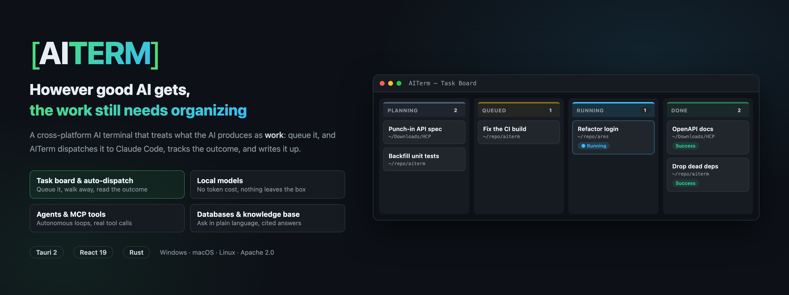
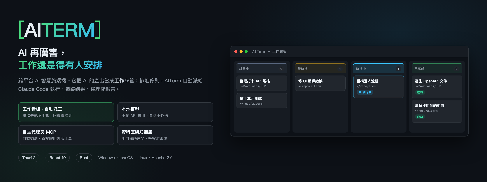

# AITerm

[](https://github.com/jamesju9999/AITERM/releases/latest)
[](LICENSE)
[](https://buymeacoffee.com/jameschu)

**[🌐 Official Website](https://aiterm.win/)** | [English](#english) | [繁體中文](#繁體中文) | ☕ [Buy Me a Coffee](https://buymeacoffee.com/jameschu)

---

<a id="english"></a>
# AITerm (English)

A powerful, cross-platform AI-enhanced terminal built with **Tauri 2**, **React 19**, and **Rust**. AITerm seamlessly integrates the traditional command-line experience with advanced AI capabilities, autonomous agents, a task board that dispatches work to Claude Code on your behalf, and project requirement management.

Beyond cloud providers, AITerm connects to **local models** (Ollama, LM Studio, oMLX, and other OpenAI-compatible endpoints) so inference runs on your own machine — **no API cost and nothing sent off-box** — which pays off for high-volume automation. It can also **bridge the Claude Code CLI to any provider** you have configured, so you run Claude Code on your OpenAI, Gemini, or local models.

## ✨ Key Features

- **Integrated AI Providers**: Out-of-the-box support for multiple LLM providers including OpenAI, Anthropic, Google, Ollama (local inference), and OpenAI-compatible endpoints. You can also sign in with a subscription account — Claude, ChatGPT, Gemini, or GitHub Copilot — with no API key to obtain.
- **AI Command Flow (`/ai`)**: Type `/ai <query>` directly in the terminal to generate and preview commands with risk-level assessment before execution.
- **Local Models · Save on Tokens**: Connect to Ollama, LM Studio, oMLX, and other local / OpenAI-compatible endpoints — inference runs on your own machine with no API cost and nothing sent off-box. Or use the Claude Code Bridge to run the Claude Code CLI on any provider you have configured.
- **Structured Command Blocks**: Every command and its output render as a distinct card instead of raw scrollback. The live terminal pane auto-expands only while a command is running and shrinks back down when idle, keeping the screen uncluttered.
- **Autonomous Agent Loop (`/agent`)**: Multi-step, goal-driven agentic execution for complex tasks, with built-in guardrails and fallback to manual confirmation for dangerous operations.
- **LoopStudio (Loop Engineering)**: A visual multi-agent orchestration workbench — an orchestrator breaks a goal down and dispatches sub-agents to work in parallel, with safety gates and a live execution trace, running autonomously until the goal is verified done instead of requiring back-and-forth confirmation.
- **Task Board**: A kanban board that hands work to Claude Code for you. Write what you want done as cards — title, which folder to work in, detailed instructions, attachments if needed — and drag one to Queued: AITerm opens a tab, launches Claude Code, delivers your instructions, and moves the card to Done with a success or failure outcome when it finishes. Queue up an evening's work instead of driving each task by hand. Cards live in projects (self-contained folders you can copy to move or share), several projects open as tabs at once, and a global concurrency cap keeps the machine sane. Interactive mode marks work you intend to discuss with Claude Code yourself, exempt from the cap and from stall detection. Finished work keeps a clean transcript you can reread, and "Requeue" clones a card to run the same thing again. Search filters all four columns by title, body or folder.
- **AI Work Report**: Turn a project's board into a formatted document. Pick a style, choose a model, and AITerm reads every card — including the full transcripts of finished work — and writes an HTML report that is saved into the project folder and kept as history. A finished card's summary is written once and cached, so a second report only processes what is new.
- **Archive**: Finished cards would otherwise pile up forever. Archive them one at a time or a whole column at once and the board keeps only what is in flight. Nothing is deleted — cards, transcripts and attachments stay put, the archive view searches and pages through them, and any card can be restored to the board.
- **AI Refine**: Jot a rough note into a task's body, press Refine, and the AI rewrites it into a brief Claude Code can execute — goal, scope, constraints, acceptance criteria — without inventing work you did not ask for. One click restores your original.
- **Code Assistant**: A dedicated tab where the AI answers questions about any project directory — it scans the file tree, searches and reads source files on its own, can render Mermaid diagrams, and lets you export the conversation to Markdown.
- **Multi-turn Chat Sidebar**: Persistent, context-aware AI chat directly beside your terminal for troubleshooting, code generation, and brainstorming.
- **AI Document & Chart Panel**: Reports, comparison tables, and charts the AI produces open in a formatted panel beside the conversation instead of raw markup — bar/line/pie charts render directly, switch to a table view for exact numbers, and export to an HTML file in one click. Available across the terminal and remote AI panels, Code Assistant, Knowledge Base, and database / cross-database Q&A.
- **Knowledge Base**: Create a notebook pointed at a folder and AITerm chunks, embeds, and indexes every document inside it, so you can ask natural-language questions with answers that cite the source documents. Works with Ollama or any OpenAI-compatible embedding provider.
- **Multi-Database Connections**: Native support for PostgreSQL, MySQL, SQLite, and ODBC. DB2 works on both macOS and Windows via a built-in Java JDBC sidecar — no driver installation required.
- **File Explorer**: A built-in sidebar file browser kept in two-way sync with the terminal's working directory — navigate in the terminal and the explorer follows, or click the "cd" button (or the folder picker built into the command input) to jump the terminal to any folder instantly.
- **Command Search & Bookmarks**: `Ctrl+F` searches across the entire block history with live scroll-to-match; `Ctrl+Shift+R` opens a bookmarks picker to save and re-fill frequently used commands.
- **Multilingual UI**: Full support for English and Traditional Chinese, switchable at runtime with no restart required.
- **Remote Terminal AI Panel**: When connected to a colleague's shared terminal, Ask AI is the same full chat panel as local — free-form Q&A, provider switching, and browsing or continuing past conversations, all through your own configured provider so the other machine needs no AI setup; `/agent` works in a remote tab too.
- **Telegram Remote Control**: Send commands to your terminal from your phone via a Telegram bot, with results streamed back to the same chat.
- **Requirement Management System**: AI-assisted discussion for feature planning, automatically generating and saving specifications (SDD) into structured, project-managed directories.
- **MCP Tools**: Connect any MCP (Model Context Protocol) server and the AI can read and write files, query data, and call external services directly — no terminal command in between. Every tool call and its result stays visible and expandable.
- **Claude Code Bridge**: Point the Claude Code CLI at any provider you have configured in AITerm — run Claude Code on your OpenAI, Gemini, or local models, and switch between them at any time.
- **Robust Terminal Engine**: Powered by `xterm.js` and `portable-pty` for a fast, native-feeling shell experience across Windows, macOS, and Linux.

## 🏗️ Architecture

AITerm uses a modern Desktop architecture communicating via Tauri IPC (invoke + events):
- **Frontend (`src/`)**: React 19 shell, `xterm.js` terminal views, component-local state management, and an intelligent frontend router for handling AI commands and streams.
- **Backend (`src-tauri/src/`)**: Rust-powered high-performance core handling PTY lifecycles, AI provider routing, SQLx-backed database connections (including a Java JDBC sidecar for DB2), Telegram bot integration, and secure local configuration (OS keyring).

## 🚀 Getting Started

### Prerequisites
- Rust 1.78+ (`rustup show`)
- Node.js 20+ (`node -v`)
- _Windows only_: Windows 11 with WebView2 runtime and MSVC build tools.

### Development
```bash
npm install
npm run tauri:dev
```
> *Note: The first build will take a few minutes as Rust dependencies are compiled. Subsequent runs are much faster.*

### Testing
```bash
# Frontend tests (Vitest + React Testing Library)
npm run test

# Rust unit & integration tests
cd src-tauri && cargo test

# Type checking
# NOT `tsc --noEmit`: the root tsconfig.json is a solution file ("files": []),
# so it checks nothing and always exits 0.
npx tsc -b
```

## 📂 Project Layout
```
src-tauri/       # Rust backend (Tauri + PTY + AI Router + DB)
  src/pty/       # PTY lifecycle and streaming
  src/ai/        # Multi-provider AI router
  tests/         # Rust integration tests
src/             # React 19 frontend
  components/    # TerminalView, ChatSidebar, etc.
  ipc/           # Typed Tauri invoke + event wrappers
docs/            # Specs and implementation plans
```

---

<a id="繁體中文"></a>


# AITerm (繁體中文)

一個強大且跨平台的 AI 智慧終端機，基於 **Tauri 2**、**React 19** 和 **Rust** 打造。AITerm 將傳統的命令列體驗與先進的 AI 能力、自主代理（Agent）、可自動把工作派給 Claude Code 執行的工作看板，以及專案需求管理完美結合。

除了雲端供應商，AITerm 也能串接**本地端模型**（Ollama、LM Studio、oMLX 及其他 OpenAI 相容端點），推論在自己機器上跑——**不花 API 費用、資料不外送**——量大的自動化任務尤其划算。也可以用 **Claude Code 橋接**，讓 Claude Code CLI 跑在你已設定的任何供應商上（OpenAI、Gemini 或本地模型皆可）。

## ✨ 核心功能

- **多重 AI 供應商整合**：開箱即支援 OpenAI、Anthropic、Google、Ollama（本地端推論）以及 OpenAI 相容端點等多種語言模型。也可以直接用訂閱帳號登入——Claude、ChatGPT、Gemini、GitHub Copilot 皆可，不必另外申請 API Key。
- **AI 指令工作流 (`/ai`)**：直接在終端機輸入 `/ai <查詢>` 即可生成指令，並在執行前提供風險等級評估與預覽。
- **本地模型・省 token 費用**：接 Ollama、LM Studio、oMLX 這類本地 / OpenAI 相容端點——推論在自己機器上跑，不花 API 費用、資料不外送。或用 Claude Code 橋接，讓 Claude Code CLI 跑在你手邊任何一個供應商上。
- **結構化指令區塊**：每個指令與其輸出都會渲染成獨立卡片，而非傳統終端機的原始捲動畫面；即時終端機視窗只在指令執行中才自動展開，閒置時自動收合，畫面保持乾淨。
- **自主代理循環 (`/agent`)**：針對複雜任務提供多步驟、目標導向的代理執行能力，內建安全防護機制，並在遇到危險操作時自動退回手動確認模式。
- **LoopStudio（循環工程）**：可視化的多代理協同工作台——主控代理拆解任務並分派子代理平行執行，搭配安全閘門與即時執行追蹤，自主循環直到目標驗證完成，不需要一問一答反覆確認。
- **工作看板**：把工作排進去，AITerm 自動派給 Claude Code 執行。把想做的事寫成卡片（標題、要在哪個資料夾做、詳細指示，需要的話還能附上檔案），拖到「待執行」，AITerm 就會開一個分頁、啟動 Claude Code、把指示送過去，做完自動搬到「已完成」並標上成功或失敗——一次排好幾件晚上再看結果，不必守在電腦前一件一件下指令。卡片歸屬於專案（自成一體的磁碟資料夾，複製即可搬移或分享），可同時開多個專案分頁，並行上限為全域設定。「互動模式」用於你打算自己跟 Claude Code 討論的工作，不佔並行額度也不會被判定卡住。完成的工作留有乾淨的對話記錄可回顧，「重新派工」會複製一張新卡片重跑同一件事。搜尋可依標題、內容或工作目錄即時過濾四個欄位。
- **AI 工作報告**：把一個專案的看板整理成一份文件。選風格、選模型，AITerm 會讀過每一張卡片（含已完成工作的完整對話記錄），產出排版好的 HTML 報告，存進專案資料夾累積成歷史。已完成的工作摘要只整理一次就快取起來，第二次產報告只需處理新完成的部分。
- **封存**：完成的卡片不會無止境堆積。可單張封存或整欄一次收起，看板只留下正在進行的事。封存不是刪除——卡片、對話記錄、附件全部留著，封存清單可搜尋、分頁翻閱，任何一張都能放回看板。
- **AI 潤飾**：工作內容隨手打幾句，按下「AI 潤飾」，AI 會改寫成一份 Claude Code 能執行的完整指示（目標、範圍、限制、驗收標準），且不會自己加上你沒要求的工作。不滿意按「還原」即換回原文。
- **程式庫協助**：獨立分頁，讓 AI 針對任意專案目錄回答問題——自動掃描檔案樹、搜尋並讀取原始碼，可繪製 Mermaid 圖表，對話還能匯出成 Markdown。
- **多輪對話側邊欄**：終端機旁內建具備上下文記憶的 AI 對話視窗，方便進行問題排解、程式碼生成與靈感發想。
- **AI 文件與圖表面板**：AI 產生的報告、比較表格與圖表會在對話右側開一個排版好的面板，而不是塞成原始碼——長條圖、折線圖、圓餅圖直接畫出來，可切換成表格檢視看確切數字，也能一鍵存成 HTML 檔；終端機與遠端 AI 面板、程式庫協助、知識庫、資料庫與跨資料庫問答皆適用。
- **知識庫**：建立筆記本並指定一個資料夾，AITerm 會自動切割、嵌入（Embedding）並索引其中的所有文件，之後即可用自然語言提問，回答附上原始文件引用來源；支援 Ollama 與任何 OpenAI 相容的 Embedding 供應商。
- **多資料庫連線**：原生支援 PostgreSQL、MySQL、SQLite、ODBC。DB2 透過內建 Java JDBC Sidecar 在 macOS 與 Windows 均可使用，無需安裝驅動程式。
- **檔案總管**：內建側邊欄檔案瀏覽器，與終端機工作目錄雙向同步——終端機切換路徑會即時反映在檔案總管，點擊「cd」按鈕或輸入框內建的資料夾選單也能立即把終端機切換到該目錄。
- **指令搜尋與書籤**：`Ctrl+F` 可跨所有區塊歷史搜尋指令並即時捲動至符合項目；`Ctrl+Shift+R` 開啟書籤選單，收藏常用指令並一鍵帶入輸入框。
- **多語言介面**：完整支援英文與繁體中文，可於執行時即時切換，不需重啟。
- **遠端終端機 AI 面板**：連進同事分享的終端機後，Ask AI 是跟本機一樣的完整對話面板——自由問答、切換 AI 供應商、瀏覽並接續歷史對話，全部走觀看端自己設定的供應商，對方那台不需要有 AI；遠端分頁也能用 `/agent`。
- **Telegram 遠端控制**：透過 Telegram Bot 從手機傳送指令至終端機，執行結果即時回傳至同一對話。
- **需求管理系統**：提供 AI 輔助的系統功能討論，可自動生成規格文件 (SDD) 並將其儲存到專案管理的結構化目錄中。
- **MCP 工具**：接上任何 MCP（Model Context Protocol）伺服器，AI 就能直接讀寫檔案、查詢資料、呼叫外部服務，不必經過終端機指令；工具的每一次呼叫與回傳都看得到、展得開。
- **Claude Code 橋接**：把 Claude Code CLI 接到 AITerm 已設定的任何供應商——用你手邊的 OpenAI、Gemini 或本地模型跑 Claude Code，模型可隨時切換。
- **強大的終端機引擎**：基於 `xterm.js` 與 `portable-pty`，在 Windows、macOS 與 Linux 上提供快速、原生的 Shell 體驗。

## 🏗️ 系統架構

AITerm 採用現代化桌面應用架構，透過 Tauri IPC（invoke + events）進行通訊：
- **前端 (`src/`)**：使用 React 19，包含 `xterm.js` 終端機視圖、元件狀態管理，以及處理 AI 指令與資料流的智慧前端邏輯。
- **後端 (`src-tauri/src/`)**：由 Rust 驅動的高效能核心，負責處理 PTY 生命週期、AI 路由、基於 SQLx 的資料庫連線（含 DB2 專用的 Java JDBC Sidecar）、Telegram Bot 整合，以及安全的本地配置（OS Keyring）。

## 🚀 快速開始

### 環境要求
- Rust 1.78+ (`rustup show`)
- Node.js 20+ (`node -v`)
- _僅限 Windows_：Windows 11（包含 WebView2 執行階段與 MSVC 建置工具）。

### 開發測試
```bash
npm install
npm run tauri:dev
```
> *提示：首次建置需要編譯 Rust 依賴套件，會花費幾分鐘的時間，之後的執行速度將大幅提升。*

### 執行測試
```bash
# 前端測試 (Vitest + React Testing Library)
npm run test

# Rust 單元測試與整合測試
cd src-tauri && cargo test

# 型別檢查
# 不可用 `tsc --noEmit`：根目錄的 tsconfig.json 是 solution file（"files": []），
# 那樣什麼都不會檢查，而且永遠回傳 0。
npx tsc -b
```

## 📂 專案結構
```
src-tauri/       # Rust 後端 (Tauri + PTY + AI Router + DB)
  src/pty/       # PTY 生命週期與資料流處理
  src/ai/        # 多重 AI 供應商路由
  tests/         # Rust 整合測試
src/             # React 19 前端
  components/    # TerminalView、對話側邊欄等元件
  ipc/           # 型別安全的 Tauri IPC 封裝
docs/            # 規格文件與實作計畫
```
