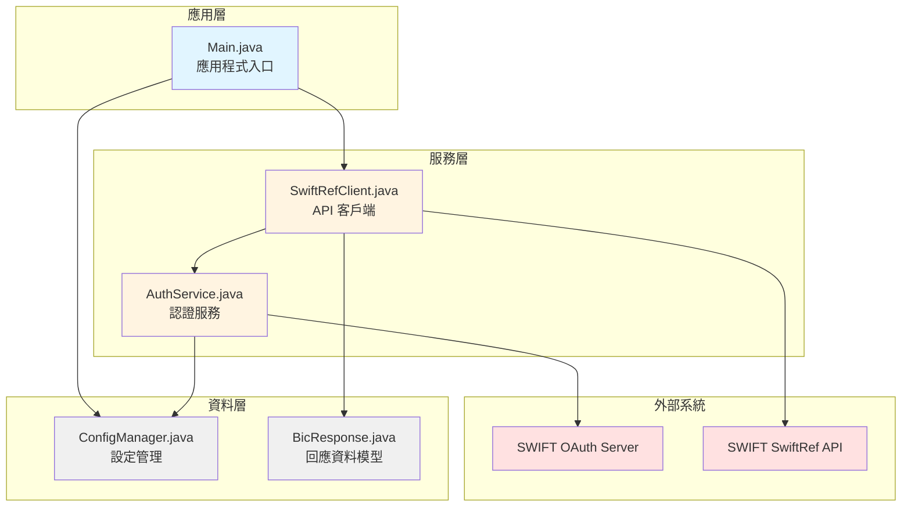
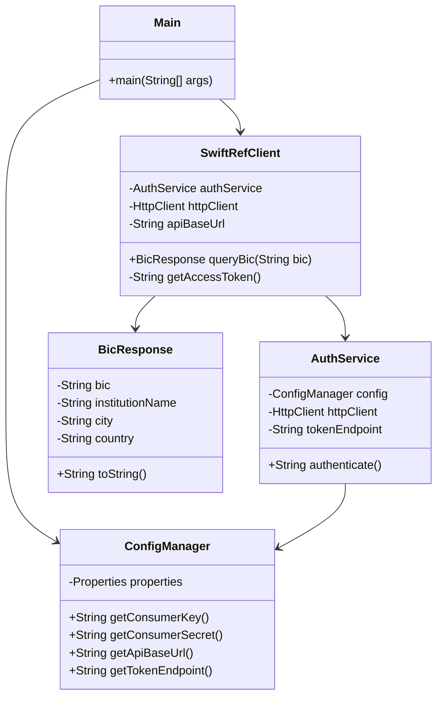
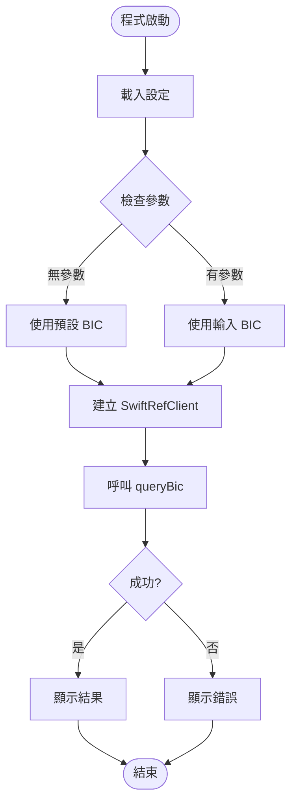
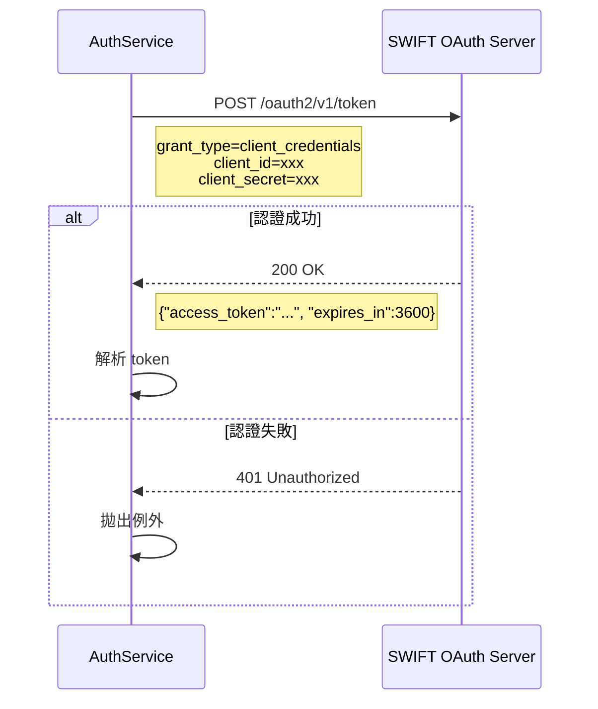
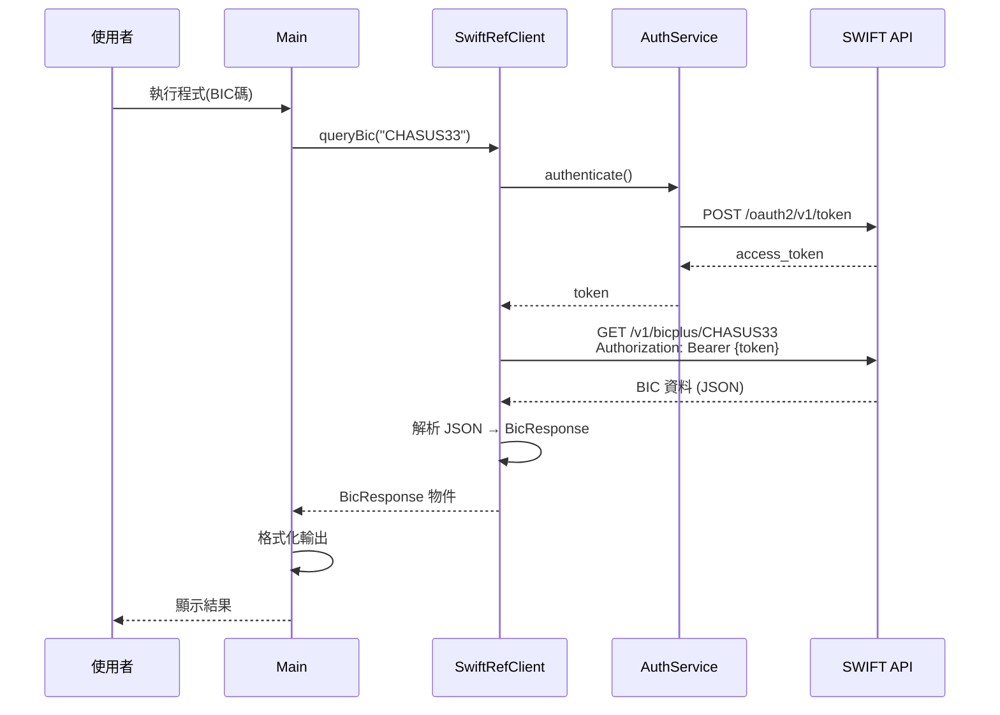

# SwiftRef API Java 呼叫範例 - 系統設計文件 (SDD)

## 1. 系統架構概述

本範例採用分層架構，將認證、API 呼叫、資料處理等關注點分離，確保程式碼易讀且可維護。

### 1.1 架構圖



### 1.2 類別關係圖



## 2. 模組設計

### 2.1 Main.java (應用程式入口)
**職責**: 
- 程式入口點
- 初始化元件
- 處理命令列參數
- 呼叫 API 並顯示結果

**流程**:


### 2.2 SwiftRefClient.java (API 客戶端)
**職責**:
- 封裝所有 SwiftRef API 呼叫
- 管理 HTTP 請求/回應
- 處理 JSON 序列化/反序列化

**核心方法**:
```java
public BicResponse queryBic(String bic) throws IOException
```

**錯誤處理**:
- HTTP 4xx/5xx 錯誤
- 網路連線異常
- JSON 解析錯誤

### 2.3 AuthService.java (認證服務)
**職責**:
- 實作 OAuth 2.0 Client Credentials Flow
- 管理 access token 的取得
- 處理認證相關錯誤

**認證流程**:


### 2.4 ConfigManager.java (設定管理)
**職責**:
- 載入設定檔 (config.properties)
- 提供環境變數覆寫機制
- 驗證必要設定項目

**設定優先順序**:
1. 環境變數 (最高優先)
2. config.properties 檔案
3. 預設值 (如果有)

### 2.5 BicResponse.java (資料模型)
**職責**:
- 對應 API 回應的 JSON 結構
- 提供資料存取方法

**JSON 對應範例**:
```json
{
  "bic": "CHASUS33",
  "institution_name": "JPMORGAN CHASE BANK, N.A.",
  "city": "NEW YORK",
  "country": "US"
}
```

## 3. API 呼叫流程



## 4. 專案結構

```
swiftref-example/
├── pom.xml
├── config.properties.example
├── README.md
└── src/
    └── main/
        └── java/
            └── com/
                └── example/
                    └── swiftref/
                        ├── Main.java
                        ├── SwiftRefClient.java
                        ├── AuthService.java
                        ├── ConfigManager.java
                        └── model/
                            └── BicResponse.java
```

## 5. 依賴項目 (Maven)

### 5.1 完整的 pom.xml